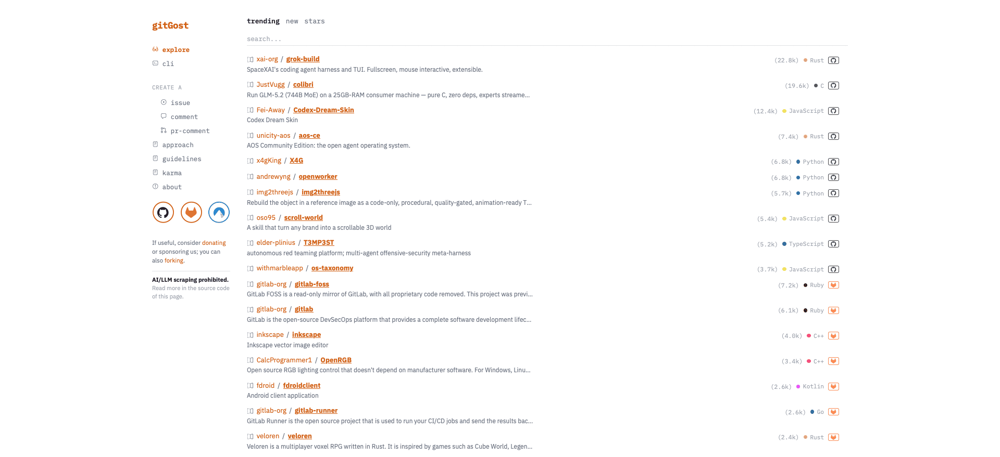

<div align="center" markdown="1">


<h1>gitGost</h1>

 **Contribute to any Git repository without exposing your identity.**
 
  Zero accounts • Zero tokens • Zero metadata • Designed for strong anonymity
</div>

---

A community-led free and open-source Git collaboration platform built for privacy, transparency, and developer freedom. Contribute anonymously, manage repositories across multiple forges, and own your workflow without vendor lock-in.

<p align="center">
  
 </p>

## One-liner demo

```bash
# Add as remote → fix → push → done. Designed to minimize identifiable traces.
git remote add gost https://gitgost.fly.dev/v1/gh/torvalds/linux
git checkout -b fix-typo
git commit -am "fix: obvious typo in README"
git push gost fix-typo:main
# → PR opened as @gitgost-anonymous with no direct trace to you; note that gitGost provides strong anonymity features, but not perfect anonymity — see the Threat Model
```

That’s it. No login, token, name, or email required — gitGost provides strong anonymity features, but not perfect anonymity — see the [Threat Model](#threat-model).

[](https://deepwiki.com/livrasand/gitGost)
[](https://mintlify.wiki/livrasand/gitGost/introduction)
[](https://saythanks.io/to/livrasand)
[](https://www.gnu.org/licenses/agpl-3.0)
[](SECURITY.md)
[](LEGAL.md)
[](https://go.dev)
[](https://github.com/livrasand/gitGost)
[](https://github.com/livrasand/gitGost)
[](https://github.com/livrasand/gitGost)
[](https://github.com/sponsors/livrasand)
<a href="https://github.com/badges/shields/pulse" alt="Activity">
        </a>
  


<br />

> "Fixed GPIO mapping bug in 10s without doxxing risk – @gitgost-anonymous"  
> [View PR ↗](https://github.com/mehdi7129/inky-photo-frame/pull/3) *(Example from mehdi7129/inky-photo-frame)*

⭐ Star this repo if you believe developers deserve the right to contribute anonymously.

## Features

| Feature                     | Description                                                                 |
|-----------------------------|-----------------------------------------------------------------------------|
| **Total Anonymity**         | Strips author name, email, timestamps, and all identifying metadata. PRs created by neutral `@gitgost-anonymous` bot. |
| **One-Command Setup**       | Just `git remote add gost <url>` – no accounts, tokens, or browser extensions. |
| **Battle-tested Security**  | Rate limiting, repository size caps, commit validation. Written in pure Go with minimal dependencies – fully auditable. |
| **Works Everywhere**        | Terminal, CI/CD, Docker, scripts – any public GitHub repo, anywhere Git runs. |
| **Anonymous Repo Browser**  | Browse code, files, branches, commits, releases, issues, pull requests, discussions and wikis across GitHub, GitLab and Codeberg — no account needed. |
| **Anonymous Contributions** | Push code and open pull requests without exposing your identity; open anonymous issues and comment on issues, PRs and GitHub Discussions. |
| **Open Source & AGPL**      | 100% transparent. Fork it, audit it, host it yourself.                     |

## Quick Start

```bash
# 1. Add the remote (replace with any public repo)
git remote add gost https://gitgost.fly.dev/v1/gh/username/repo

# 2. Create your branch and commit with a detailed message
git checkout -b my-cool-fix
git commit -am "fix: typo in documentation

This commit fixes a grammatical error in the README.
The word 'recieve' should be 'receive'."

# 3. Push – PR opens anonymously
git push gost my-cool-fix:main
```

Done. The PR appears instantly from `@gitgost-anonymous` with your commit message as the PR description.

**Pro tip:** Write detailed commit messages! Your commit message becomes the PR description, allowing you to provide context while staying anonymous.

## Download Android app

> [!Warning]
> **Free and Open-Source Android is under threat.**
>
> Google will turn Android into a locked-down platform, restricting your essential freedom to install apps of your choice. Make your voice heard
>
> [**Keep Android Open**](https://keepandroidopen.org/).

You can download the app from GitHub's [Releases](https://github.com/livrasand/gitGost/releases/) page or install it from the [livrasand F-Droid Repo](https://fdroid.livrasand.com/).


[](https://github.com/livrasand/gitGost/releases/)
[](fdroidrepos://fdroid.livrasand.com/repo?fingerprint=4fc12351f04fb991cd68a681a1595627adabfa02119aaa3606deaba1dab13ad2)
[](https://apps.obtainium.imranr.dev/redirect?r=obtainium://add/https://github.com/livrasand/gitGost)

## Why developers love gitGost

> “Your commit history shouldn’t be an HR liability forever.”

- No permanent public record of your activity  
- Safely contribute to controversial projects (employer or country doesn’t like it? no problem)  
- Stop email harvesting & doxxing from public commits  
- Fix that one annoying typo without attaching your name for eternity  
- Be a ghost when you want to be

Built for developers who actually care about privacy.

## 💸 Donations

gitGost is a non-profit project run entirely by volunteers, not employees.
We need your funds to pay for software, hardware and hosting around continuous integration and future improvements to the project.
Every donation will be spent on making gitGost better for our users.

Please consider a regular donation through [GitHub Sponsors](https://github.com/sponsors/livrasand).

## Repository Opt-Out

Maintainers can block anonymous contributions via gitGost by adding `DENY_ALL: true` to the `.gitgost.yml` file in their repository root:

```yaml
# .gitgost.yml
DENY_ALL: true
```

When this is set, gitGost will reject any push attempt before creating a fork or PR. Contributors will see:

```text
remote: CONTRIBUTION BLOCKED
remote:
remote: This repository does not accept anonymous contributions
remote: via gitGost. Please contact the maintainer directly.
error: push rejected: repository has opted out of gitGost
```

If the file does not exist or `DENY_ALL` is not set, contributions are allowed by default.

## Legitimate Use Cases

gitGost is intended for responsible, good-faith contributions where identity exposure is unnecessary or undesirable.

Examples include:

Fixing typos or documentation errors without creating a permanent contribution record
Contributing to projects that may conflict with employer policies
Participating in politically sensitive or controversial repositories
Reducing exposure to email harvesting and scraping
Experimenting or testing changes without attaching personal metadata
Contributing from jurisdictions where visibility may create risk

gitGost is designed to enable privacy — not remove accountability from the review process.

All pull requests are public and subject to maintainer approval.

## When NOT to use gitGost

Do not use gitGost for:

Harassment or abuse
Spam or automated PR flooding
Evading bans or moderation
Submitting malicious code
Avoiding legal responsibility
Circumventing repository contribution policies

gitGost enforces rate limits, validation checks, and repository constraints. Abuse attempts will be mitigated.

If your goal is to harm, disrupt, or deceive — this project is not for you.

## Threat Model

gitGost is designed to protect against common identification threats in contributions to public repos, but does not offer perfect anonymity. Below details what it protects against, what it does not, who it protects against, and key assumptions.

For a terse, user-facing view of guarantees and data retention, see [Privacy Guarantees](Privacy%20Guarantees.md).

### gitGost protects against:

- Public exposure of name and email in commits
- Direct association between personal GitHub account and PR
- Passive metadata collection in public repos
- Permanent history of minor contributions

### gitGost does NOT protect against:

- IP identification (using VPN/Tor is recommended)
- Code style analysis (stylometry)
- Advanced temporal correlation
- Targeted deanonymization by adversaries with resources

### Considered adversaries

- Recruiters / HR
- Hostile maintainers
- Email scrapers
- Governments or companies with basic monitoring

### Not considered adversaries

- Nation states with infrastructure access
- Actors with active user surveillance
- Deep forensic code style analysis

### Explicit assumptions

gitGost assumes the user:

- Uses a trustworthy network (VPN / Tor)
- Does not reuse unique phrases or identifiable style
- Does not mix anonymous and personal contributions to the same repo
- Understands that perfect anonymity does not exist

For the full model, see [THREAT_MODEL.md](THREAT_MODEL.md). For more operational details, see [SECURITY.md](SECURITY.md).

## Security & Limits (we’re not reckless)

- Max 5 PRs/IP/hour
- Repository size ≤ 500 MB
- Commit size ≤ 10 MB
- Full validation of refs and objects
- No persistence of your data

> **GitHub only:** Due to GitHub's platform limits, fork repositories created by gitGost are manually deleted to stay under the 40,000-repository cap. This is a GitHub-specific constraint and does not affect functionality.

Everything is designed to prevent abuse while keeping you anonymous.

## gitGost for Resilient Networking

> [!WARNING]
> **Alpha software**
>
> GREN is currently in **Alpha**. It is under active development and **has not yet been thoroughly tested**. Expect bugs, incomplete features, and breaking changes. Do not rely on it for production or critical workflows.

Git manages the repository. GREN manages the network. The GREN client pauses, resumes, queues and retries Git operations in the background — without replacing Git itself.

The client is written in Go, with pre-compiled binaries available for Mac,
Windows and Linux. Check out the [website](https://gitgost.livrasand.com/)
for an overview of features.

### From binary

<a href="https://github.com/livrasand/gitGost/releases">
</a>

### From Homebrew

```bash
brew tap livrasand/tap
brew trust livrasand/tap
brew install git-gost
git gost install
```

### From curl

```bash
curl -fsSL https://gitgost.livrasand.com/install | bash
```

### Using

```shell
# Clone runs like a download manager
$ git gost clone https://github.com/openai/openai.git
→ Job created. ID: 82 — Running in background...
$ git gost watch 82
→ 82   openai   74%   Downloading pack 18/35
```

### Getting started

```shell
$ git gost clone https://github.com/openai/openai.git
# Manage the queue while the download runs in the background
$ git gost jobs
$ git gost watch 82
$ git gost pause 82   # or resume / cancel
```

# Why GREN Exists

Git was designed for reliable networks. Many developers don't have that luxury.

Around the world, developers work with unstable, slow or expensive Internet connections. A dropped Wi-Fi signal, a temporary mobile connection or an overloaded network can interrupt a clone, fetch or push at the worst possible moment.

GREN (gitGost for Resilient Networking) was created to make Git operations more resilient in these environments.

Instead of replacing Git, GREN sits alongside it, running network operations in the background. Downloads and uploads can be paused, resumed, queued and retried automatically, allowing developers to continue working while GREN takes care of unreliable connectivity.

Whether you're working from a rural community, using mobile data, travelling, or simply dealing with an unstable network, GREN helps Git become more tolerant of interruptions.

Because access to open source software shouldn't depend on having perfect Internet.

## Who is GREN for?

GREN is especially useful for developers who:

* live in regions with slow or unreliable Internet
* rely on mobile or metered connections
* frequently experience connection interruptions
* work remotely while travelling
* clone or push very large repositories
* want long-running Git operations to continue in the background

## Who may not benefit as much?

If you have a stable high-speed Internet connection and rarely experience interrupted Git operations, GREN may provide only a small convenience.

Git already works well under ideal network conditions.

## My goal

My goal isn't to change how Git works.

My goal is to make Git more resilient when the network isn't.

## License

**AGPL-3.0** – Free forever, open source, and copyleft.  
If you run a public instance, you must provide source code.

→ [LICENSE](LICENSE)

## Contributing

### Deploying Your Own Instance

I'd love it if you deployed your own version of this app! To do so currently will take some knowledge of how a webserver runs. This app is built with Go and there are a bunch of different ways to deploy. The official instance is on [https://gitgost.livrasand.com/](https://gitgost.livrasand.com/)

Community instances are listed here. Submit a patchset to add your own self-hosted instance to that list.

Hopefully a more comprehensive guide will be written at some point, but for now feel free to reach out to the [Issues](https://github.com/livrasand/gitGost/issues) if you have any questions.

### Contributing Anonymously

```bash
git remote add gost https://gitgost.fly.dev/v1/gh/livrasand/gitGost
git push gost my-feature:main
```

(Yes, even gitGost eats its own dogfood 👻)

### Going further: hide your IP with torsocks

gitGost strips your name, email, and metadata — but your IP is still visible to the server. If you need a stronger anonymity guarantee, wrap your push with **torsocks**, which routes the connection through the Tor network so the server only sees a Tor exit node IP.

#### Install

```bash
# Debian/Ubuntu
sudo apt install tor torsocks

# Arch
sudo pacman -S tor torsocks

# macOS
brew install tor torsocks
```

#### Start Tor

```bash
sudo systemctl start tor   # Linux
brew services start tor    # macOS
```

#### Push through Tor

```bash
torsocks git \
  -c http.extraHeader="X-Gost-Authorship-Confirmed: 1" \
  push gost my-feature:main
```

#### Optional: persistent alias so you never forget

```bash
# Inside your repo
git config http.extraHeader "X-Gost-Authorship-Confirmed: 1"

# In ~/.gitconfig
[alias]
    ghost = "!torsocks git"
```

Then simply:

```bash
git ghost push gost my-feature:main
```

#### Verify your IP is masked before pushing

```bash
torsocks curl https://check.torproject.org/api/ip
# → {"IsTor": true, "IP": "185.220.101.x"}
```

> **Heads-up:** Tor is slow. A push that normally takes seconds may take a few minutes. This is expected — Tor routes traffic through three encrypted nodes worldwide. gitGost's 10 MB commit limit is partly sized with this in mind.

### Strip metadata from binary files before committing

gitGost anonymizes commit metadata, but **binary files (images, PDFs, Office documents) can contain embedded metadata** — EXIF data, GPS coordinates, author names, device info — that reveal your identity regardless of commit anonymization. Strip it before committing with **exiftool**.

#### Install

```bash
# Debian / Ubuntu
sudo apt install libimage-exiftool-perl

# Arch
sudo pacman -S perl-image-exiftool

# macOS
brew install exiftool

# Windows: download the executable from https://exiftool.org
# Extract exiftool(-k).exe, rename to exiftool.exe, place in PATH
```

#### Verify and strip

```bash
# Check what metadata a file exposes
exiftool photo.jpg
# → GPS Latitude  : 48.8566   ← your location
# → Author        : John Doe  ← your name

# Strip all metadata from a single file
exiftool -all= photo.jpg

# Strip recursively from a directory
exiftool -all= -r ./assets/
```

#### Then commit and push safely

```bash
git add assets/
git commit -am "add: project screenshots"
git push gost my-branch:main
# → PR opened as @gitgost-anonymous — no metadata, no trace
```

> **Note:** exiftool creates backup files (`*_original`) by default. Add `-overwrite_original` to skip them: `exiftool -all= -overwrite_original photo.jpg`.

### Windows alternatives

`torsocks` is not available on Windows natively. Use one of the following options instead.

#### Option 1: Tor Browser + SOCKS5 proxy (easiest)

```bash
# 1. Download and install Tor Browser
#    https://www.torproject.org/download/

# 2. Open it and leave it running (exposes SOCKS5 on 127.0.0.1:9150)

# 3. Configure Git to use it
git config --global http.proxy socks5h://127.0.0.1:9150

# 4. Push normally
git -c http.extraHeader="X-Gost-Authorship-Confirmed: 1" push gost my-branch:main
```

When done, remove the global proxy:

```bash
git config --global --unset http.proxy
```

Or configure it per-repo only (recommended):

```bash
# Inside the repo, not global
git config http.proxy socks5h://127.0.0.1:9150
git config http.extraHeader "X-Gost-Authorship-Confirmed: 1"
```

#### Option 2: WSL2 (Windows Subsystem for Linux)

If you already have WSL2, it works exactly like Linux inside it:

```bash
# Inside WSL2 (Ubuntu/Debian)
sudo apt install tor torsocks
sudo service tor start

torsocks git push gost my-branch:main
```

WSL2 has its own network stack separate from Windows, so anonymity is preserved correctly.

## Made with ❤️ for privacy

## Service Administration

### Panic button — suspend and restore the service

If abusive activity is detected (bot submissions, coordinated spam), you can suspend the service immediately. While suspended, all pushes are rejected with an explanatory message and the site shows a banner.

**Suspend the service:**

```bash
curl -X POST https://gitgost.fly.dev/admin/panic \
  -H "Content-Type: application/json" \
  -d '{"password":"<PANIC_PASSWORD>","active":true}'
```

**Restore the service:**

```bash
curl -X POST https://gitgost.fly.dev/admin/panic \
  -H "Content-Type: application/json" \
  -d '{"password":"<PANIC_PASSWORD>","active":false}'
```

> **Note:** If you receive a ntfy alert with action buttons (Activate Panic / Deactivate Panic), those buttons use single-use tokens valid for **10 minutes**. If the tokens expire before you tap them, use the `curl` commands above with your `PANIC_PASSWORD` — those always work.

**Handy shell aliases** (add to your `~/.zshrc` or `~/.bashrc`):

```bash
export PANIC_PASSWORD="your-password-here"

alias gitgost-suspend='curl -s -X POST https://gitgost.fly.dev/admin/panic \
  -H "Content-Type: application/json" \
  -d "{\"password\":\"$PANIC_PASSWORD\",\"active\":true}"'

alias gitgost-restore='curl -s -X POST https://gitgost.fly.dev/admin/panic \
  -H "Content-Type: application/json" \
  -d "{\"password\":\"$PANIC_PASSWORD\",\"active\":false}"'
```

Then simply run `gitgost-restore` to bring the service back online.

### Close abusive PRs (rollback burst)

After a burst attack, close all PRs created during the attack window:

```bash
curl -X POST https://gitgost.fly.dev/admin/rollback \
  -H "Content-Type: application/json" \
  -d '{"password":"<PANIC_PASSWORD>"}'
# → {"closed": 12, "failed": 0, "closed_urls": [...]}
```

This closes up to 2 hours of recorded PRs in parallel via the GitHub API. PRs older than 2 hours are not affected.

## Community Integrations

> Want to add your project? Open a pull request.

| Project | Description | Repository |
|---------|-------------|-------------|
| **bug-bounties** | Anonymous bug bounty program submissions powered by gitGost. Uses a server-side proxy to create GitHub issues anonymously through gitGost. | https://github.com/Lissy93/bug-bounties |

## Disclaimer

_gitGost does not host any content. All content on gitGost is from GitHub, GitLab and Codeberg. GitHub is a trademark of GitHub, Inc. GitLab es a trademark of GitLab Inc. Codeberg is a trademark of Codeberg e.V._

---

> [!IMPORTANT]
> Upvote gitGost on [Product Hunt](https://www.producthunt.com/posts/gitgost-anonymous-git-contributions), [PeerPush](https://peerpush.com/p/gitgost), to help me promote it.

[](https://x.com/intent/tweet?text=Check%20out%20this%20project%20on%20GitHub:%20https://github.com/livrasand/gitGost%20%23gitGost%20%23anonymous%20%23privacy)
[](https://www.facebook.com/sharer/sharer.php?u=https://github.com/livrasand/gitGost)
[](https://www.linkedin.com/sharing/share-offsite/?url=https://github.com/livrasand/gitGost)
[](https://www.reddit.com/submit?title=Check%20out%20this%20project%20on%20GitHub:%20https://github.com/livrasand/gitGost)
[](https://t.me/share/url?url=https://github.com/livrasand/gitGost&text=Check%20out%20this%20project%20on%20GitHub)

Be a ghost. Fix the internet.

*✨ Thanks for visiting **gitGost**!*


